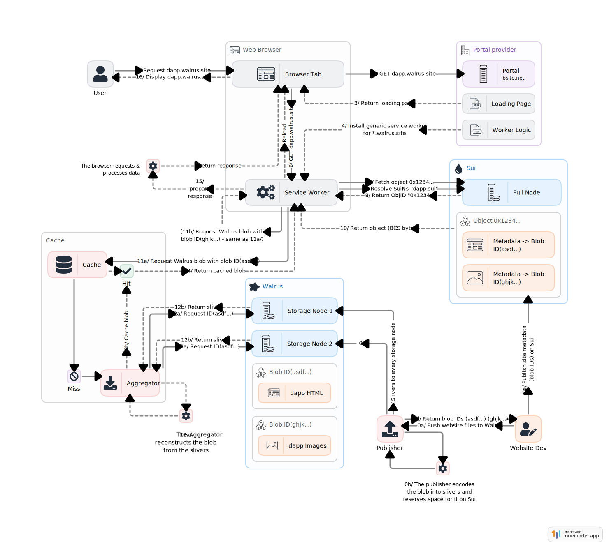

# Technical Overview

In the following sections, we delve deeper in the technical specification of Walrus Sites.

## High-level picture

Walrus Sites are enabled by Sui and Walrus. The resources of the Walrus Site (`html`, `css`, `js`,
images, etc.) are stored on Walrus, while the main entry point to it is an object stored on Sui,
which contains the metadata for the site and point to the Walrus blob IDs.

### The Walrus Sites objects on Sui

A Walrus `Site` is represented on Sui as a very simple object:

``` move
struct Site has key, store {
    id: UID,
    name: String,
}
```

The resources associated with this site are then added to this object as [dynamic
fields](https://docs.sui.io/concepts/dynamic-fields/) of type `Resource`:

``` move
struct Resource has store, drop {
    path: String,
    content_type: String,
    content_encoding: String,
    // The walrus blob id containing the bytes for this resource
    blob_id: u256,
}
```

Each resource contains

- the `path` of the resource, for example `/index.html` (all the paths are always represented as
  starting from root `/`);
- the `content_type` of the resource, for example `text/html`;
- the `content_encoding` of the resource (at the moment the only available value is `plaintext`);
  and
- the `blob_id`, which is the Walrus blob ID where the resource can be found.

These `Resource` dynamic fields are keyed with a struct of type `ResourcePath`

``` move
struct ResourcePath has copy, store, drop {
    path: String,
}
```

This struct just holds the string of the path (`/index.html`); having a separate type ensures that
we will not have namespace collisions with other dynamic fields, possibly added by other packages.

To see this in action, look at [a Walrus Site in the
explorer](https://suiscan.xyz/testnet/object/0x049b6d3f34789904efcc20254400b7dca5548ee35cd7b5b145a211f85b2532fa),
and check its dynamic fields.

### The site rendering path

Given the Sui object ID of a Walrus Site, it is easy to look up the resources that compose it
by looking at the dynamic fields, and then fetch these resources from Walrus using the blob ID
contained in the `Resource` struct.

The only outstanding question is, therefore, how to perform these lookups on the client. A few
approaches are possible:

- Having a server that accepts requests for a Sui object ID and possibly a path, and performs this
  resolution on behalf of the client, serving back the resource as a standard HTML Response.
- Using a custom application on the client that has both a web browser and knowledge of how Walrus
  Sites work, and can locally perform this resolution.
- A hybrid approach based on service workers, where a service worker that is able to perform the
  resolution is installed in the browser from a Portal.

All of these approaches are viable (the first has been used for similar applications in IPFS
gateways, for example), and have trade-offs. As an initial step, we have chosen to use the
service-worker based approach, as it is light weight and ensures that the Portal does not have to
process all the traffic from clients. This approach is described in the following.

### Browsing and domain isolation

We must ensure that, when browsing multiple sites through a Portal, for example the one hosted at
<https://walrus.site>, these sites are isolated. Isolation is necessary for security, and to ensure
that the wallet connection in the browser works as expected.

To do so, we give each Walrus Site a specific *subdomain* of the Portal's domain. For example, the
Flatland mint dApp is hosted at <https://flatland.walrus.site>, where the subdomain `flatland` is
uniquely associated to the object ID of the Walrus Site through SuiNS.

Walrus Sites also work without SuiNS: a site can *always* be browsed by using as subdomain the
Base36 encoding of the Sui object ID of the site. For the Flatland dApp, this URL is:
<https://44terjw9uzwbmtful0387e2bx3k3ro64s0it82hw9x9sz4ttm.walrus.site>.

Base36 was chosen for two reasons, forced by the subdomain standards:

1. A subdomain can have at most 63 characters, while a Hex-encoded Sui object ID requires 64.
1. A subdomain is case *insensitive*, ruling out other popular encodings, e.g., Base64 or Base58.

## The end-to-end resolution of a Walrus Site

We now show in greater detail how a Walrus Site is rendered in a client's browser with the service
worker approach. The steps below all reference the following figure:



- **Site publishing** (step 0): The site developer publishes the Walrus Site using the
  [`site-builder`](#the-site-builder), or making use of a publisher. Assume the developer uses the
  SuiNS name `dapp.sui` to point to the object ID of the created Walrus Site.
- **Browsing starts** (step 1): A client browses `dapp.walrus.site/index.html` in their browser.
- **Service worker installation** (steps 2-6): The browser connects to the Portal hosted at
  `walrus.site`, which responds with a page that installs the service worker for
  `dapp.walrus.site`. The page is refreshed to activate the service worker.
- **Site resolution** (steps 7-10): The service worker, which is now installed, interprets its
  *origin* `dapp.walrus.site`, and makes a SuiNS resolution for `dapp.sui`, obtaining the related
  object ID. Using the object ID, it then fetches the dynamic fields of the object (also checking
  [redirects](./portal.md)). From the dynamic fields, it selects the one for `/index.html`, and
  extracts its Walrus blob ID and content type.
- **Blob fetch** (steps 11-14): Given the blob ID, the service worker queries a Walrus aggregator
  for the blob.
- **Returning the response** (steps 15-16): Now that the service worker has the bytes for
  `/index.html`, and its `content_type`, it can craft a response that is then rendered by the
  browser.

These steps are executed for all resources the browser may query thereafter (for example, if
`/index.html` points to `assets/cat.png`).

## The site builder

To facilitate the creation of Walrus Sites, we provide the "site builder" tool. The site builder
takes care of creating Walrus Sites object on Sui, with the correct structure, and stores the site
resources to Walrus. Refer to the [tutorial](./tutorial.md) for setup and usage instructions.
