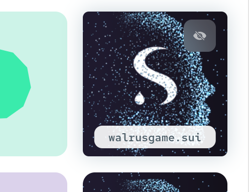

# Bonus: Set a SuiNS name

Browsing a URL like `https://29gjzk8yjl1v7zm2etee1siyzaqfj9jaru5ufs6yyh1yqsgun2.walrus.site` is not
particularly nice. Therefore, Walrus Sites allows to use SuiNS names (this is like DNS for Sui) to
assign a human-readable name to a Walrus Site. To do so, you simply have to get a SuiNS name you
like, and point it to the object ID of the Walrus Site (as provided by the `publish` or `update`
commands).

Let's do this step by step.

## Get a SuiNS name

- Navigate to <https://testnet.suins.io> and buy a domain name with your Testnet wallet. For
  example, `walrusgame` (this specific one is already taken, choose another you like).

  ```admonish note
  At the moment, you can only select names that are composed of letters `a-z` and numbers `0-9`, but
  no special characters (e.g., `-`).
  ```

## Map the SuiNS name to the Walrus Site

Now, you can set the SuiNS name to point to the address of your Walrus Site. To do so, go to the
["names you own"](https://testnet.suins.io/account/my-names) section of the SuiNS website, click on
the "three dots" menu icon above the name you want to map, and click "Link To Wallet Address". Paste
in the bar the object ID of the Walrus Site, check that it is correct, and click "Apply".

After approving the transaction, we can now browse <https://walrusgame.walrus.site>!

### The CLI way

For completeness, we report here a manual way of setting the mapping between the SuiNS name and the
Walrus Site, using the CLI.

#### Get the SuiNS object ID

Go to the ["names you own"](https://testnet.suins.io/account/my-names) section of the SuiNS website,
click the three-dots menu on the top-right corner of the name, choose "View all info", and copy the
`ObjectID`. In our case, this is `0x6412...`.

#### Send the SuiNS registration object to the address you use with the Sui CLI

The steps that follow require that the SuiNS registration object is owned by the address you are
using on the Sui CLI. Therefore, unless you use the same address in your browser wallet and the CLI,
we need to send this registration object from the address you use in your browser wallet to the
address of your Sui CLI.

To find the Sui CLI address, execute:

``` sh
sui client active-address
```

Then, from your browser wallet, select the "Assets" tab and look for the NFT of the SuiNS
registration, which should look as follows:



Click on it, scroll down to "Send NFT", and send it to the address discovered with the command
above. Now, your Sui CLI address owns the registration NFT, and you can proceed to the next step.

#### Use the CLI to map the SuiNS name to the Walrus Site

This step associates the name `walrusgame` to the object ID of our Walrus Site. There are possibly
many ways to achieve this, one is to issue the following transaction using the Sui CLI to create
this mapping:

```sh
SUINS_UTILS_PACKAGE=0x7954ae683314ec7e156acbf0c0fc964ce035fd7f456fe7576848226502cfde1b
SUINS_CORE_OBJECT=0x300369e8909b9a6464da265b9a5a9ab6fe2158a040e84e808628cde7a07ee5a3
MY_SUINS_REGISTRATION_OBJECT=0x6412... # adjust this to your own SuiNS object
MY_WALRUS_SITE_OBJECT=0x5ac9... # adjust this to your Walrus Site object
sui client call \
    --package $SUINS_UTILS_PACKAGE \
    --module direct_setup \
    --function set_target_address \
    --gas-budget 500000000 \
    --args $SUINS_CORE_OBJECT \
    --args $MY_SUINS_REGISTRATION_OBJECT \
    --args "[$MY_WALRUS_SITE_OBJECT]" \
    --args 0x6
```

```admonish note
Note that the SuiNS package and object on Testnet may change. You can find the latest ones by
looking at the `TESTNET_CONFIG` in the [SuiNS
contract](https://github.com/MystenLabs/suins-contracts/blob/main/sdk/src/constants.ts).
```
